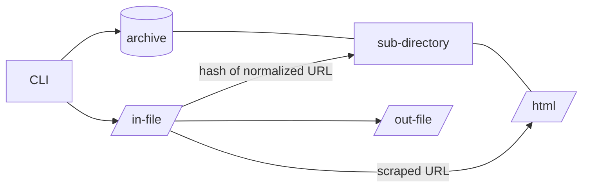
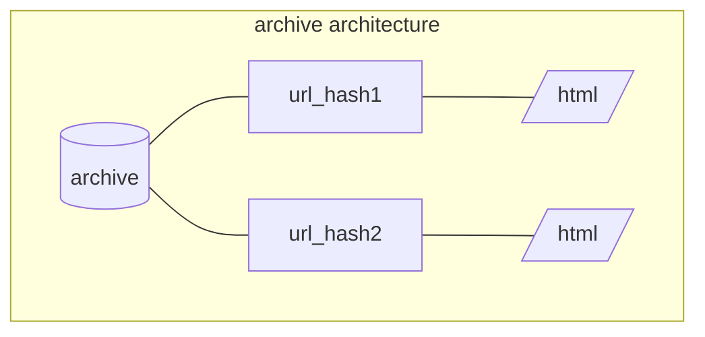
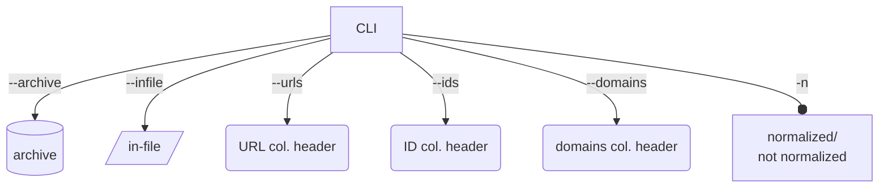
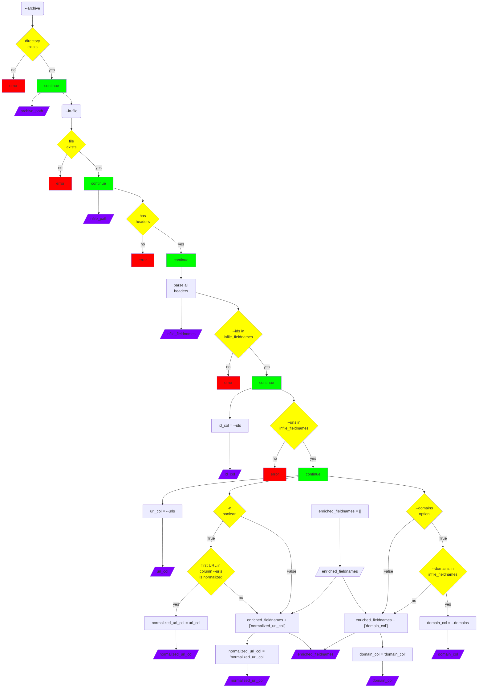
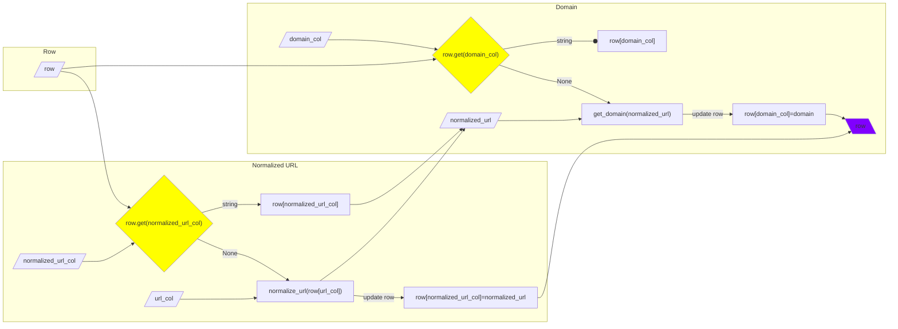
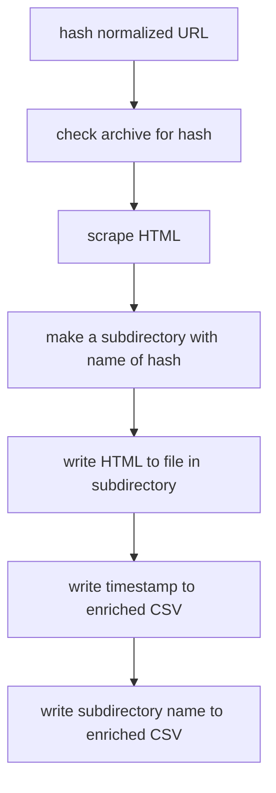

# Archive HTML

The program `archive-html` takes a list (CSV file) of URLs and enriches each row with the following data:

1. **metadata about the URL**
    - normalized version of the URL
    - domain name
2. **data about the archived HTML**:
    - name of a sub-directory which contains a file of the page's scraped HTML
    - timestamp of when the HTML was scraped and archived

# Proposed Data Structure

From the Command Line (CLI), the user provides (1) a path to the archive which will store the scraped HTML, (2) a path to the in-file which contains the URLs and their IDs, as well as the header names of the two mandatory columns: (3) IDs and (4) URLs.



The name of each sub-directory in the archive is a hash of the normalized URL, which guarantees that the archive does not contain duplicate archives of the same URL.

The normalized URL is hashed using Python's native `md5` package.

```python
from hashlib import md5
hash_of_url = md5(str.encode(normalized_url)).hexdigest()
```

## The In-File
The in-file must be a CSV with headers and have at least the following 2 columns: ID and URL.

### **Minimum Requirements of the In-File:**
|id|url|
|--|--|
|tcbeehb0040dumd|https://medialab.sciencespo.fr/activites/epo/|
|qvsfbq6yfkwgtm3|https://twitter.com/bu_unistra/status/1592121602480955392|
|2gm269lmsapwn49|https://www.dariah.eu/2022/10/10/mutual-learning-workshop-for-improving-cultural-heritage-bibliographical-data/|


### **Maximum Elements of the In-File Taken into Account**
The in-file CSV may contain many other columns and metadata, but the program `archive-html` will only parse the following data:
|id|normalized_url|domain|
|--|--|--|
|tcbeehb0040dumd|medialab.sciencespo.fr/activites/epo|medialab.sciencespo.fr|
|qvsfbq6yfkwgtm3|twitter.com/bu_unistra/status/1592121602480955392|huma-num.fr|
|2gm269lmsapwn49|dariah.eu/2022/10/10/mutual-learning-workshop-for-improving-cultural-heritage-bibliographical-data|dariah.eu|

All data existing in the in-file will be reproduced in the enriched out-file. This program can be used to both archive HTML and add data about the archiving process to an existing dataset with many headers and metadata attached to a URL.

## Output
The program `archive-html` generates two types of files. 

1. First, it produces an enriched CSV, which rewrites all the existing data from the in-file and adds data about the archived HTML. In the case of a simple in-file with a raw URL (https://medialab.sciencespo.fr/activites/epo/) and its ID (tcbeehb0040dumd), the out-file would look like the following:

|id|normalized_url|domain|archive_subdirectory|archive_timestamp|
|--|--|--|--|--|
|tcbeehb0040dumd|medialab.sciencespo.fr/activites/epo|medialab.sciencespo.fr|8b058b21fea0cd4d36368998dc1b18a5|2022-11-18 14:53:44.844199|

2. Second, the program produces sub-directories for each URL succesfully scraped and archived. For example, if the user gave the option `--archive ./archive/` in the command, line, the HTML of the URL https://medialab.sciencespo.fr/activites/epo/ would be stored in the directory `./archive/8b058b21fea0cd4d36368998dc1b18a5/`

### *wish-list*:
3. *We would like to also resolve URLs discovered in the scraped HTML and save them to a CSV in the archived URL's sub-directory.*
4. *And we would like to download media files in the scraped HTML and save them to the archived URL's sub-directory.*


# Proposed Architecture

## Command Line
The program will except 6 arguments.
- `--archive` (**required**, dir) : path to the main archive directory
- `--infile` (**required**, file) : path to the in-file CSV
- `--urls` (**required**, str) : name of column containing the URLs to be processed; if normalized URLs are in the dataset this should point to the column of the normalized URLs
- `--ids` (**required**, str) : name of column of the URLs' IDs
- `--domains` (*optional*, str) : name of column of the domain names, if present
- `-n` (*optional*, bool) : True if the given URLs are already normalized



## Parse CLI Arguments
As shown in the decision tree below, the program parses the CLI arguments to determine how it will process the incoming data file.

Returns:
- `archive_path` : path to directory
- `infile_path` : path to file
- `infile_fieldnames` : list of headers in file
- `enriched_fieldnames` : list of headers to be added to `infile_fieldnames` ("domain_col" and/or "normalized_url_col")
- `id_col` : string of key for the column containing IDs in the file when read as `csv.DictReader` object
- `url_col` : string of key for the column containing URLs in file when read as `csv.DictReader` object
- `domain_col` string of key for the column containing domain names in file when read as `csv.DictReader` object (set to "domain_col" when the in-file did not have domain names)
- `normalized_url_col` : string of key for the column containing normalized_urls in file when read as `csv.DictReader` object (the value of `nonrmalized_url_col` will be the same as `url_col` if the URLs are already normalized)

When parsing the dataset, the program will call columns using strings stored in the variables `url_col`, `domain_col`, `normalized_url_col`, and `id_col`. The column name for the normalized URLs will be the same as that entered via the CLI in the option `--urls` (stored in `url_col`) if the URLs in the dataset are already normalized. If the URLs are not normalized, the program will create a column `normalized_url_col` and, while parsing the CSV row by row, every time it discovers that a cell in the column `normalized_url_col` is empty, it will create a normalized version of the URL in column `url_col` and write it into the column `normalized_url_col`. The same sort of enrichnment will be done in the created column `domain_col` if the dataset does not already have domain names.



## Parse In-File

Next, the program parses the entire incoming CSV file, row by row, both enriching the row's URL as well as fetching and archiving its HTML.

Enrichment steps:

1. If there's no data in the column known under the variable `normalized_url_col`, the program normalizes the URL in `row[url_col]`.
2. If there's no data in the column known under the variable `domain_col`, the program gets the domain name from the normalized URL.
3. The program returns a (potentially) modified `row` dictionary object.

Parameters
- `row` (dict) from `csv.DictReader`
- `normalized_url_col` (str)
- `url_col` (str)
- `domain` (str)

Return:
- `row` (dict)



Archiving steps:

3. The program creates a hash of the normalized URL.
4. It then searches in the archive directory for any sub-directories bearing that name.
5. If there are no subdirectories with that name, the program attempts to call the URL with the concatenation of `https://` and `normalized_url`.
4. If the call is unsuccessful, the problematic URL is logged along with its domain name, and the program moves onto the next URL.
5. If the call is successful, the program attempts to scrape the HTML from the page and write the response to a file in the subdirectory.
6. The current time is recorded and given to the field `archive_timestamp`.
7. The hash of the normalized URL is given to the field `archive_subdirectory`.

Parameters:
- `row` (dict) in `csv.DictReader`
- `archive` (str)
- `normalized_url_col` (str)

