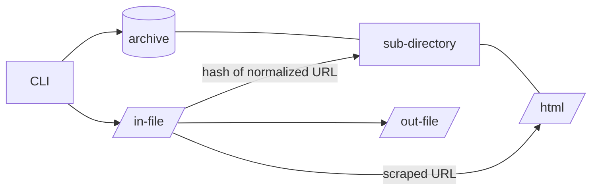
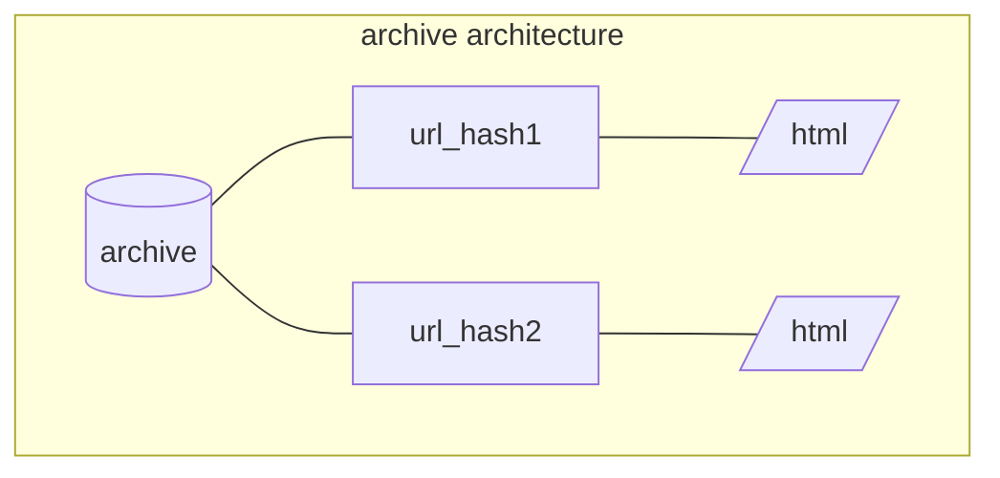
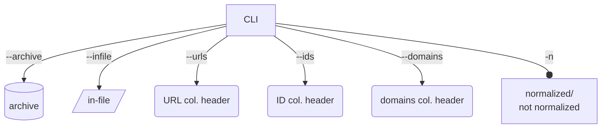
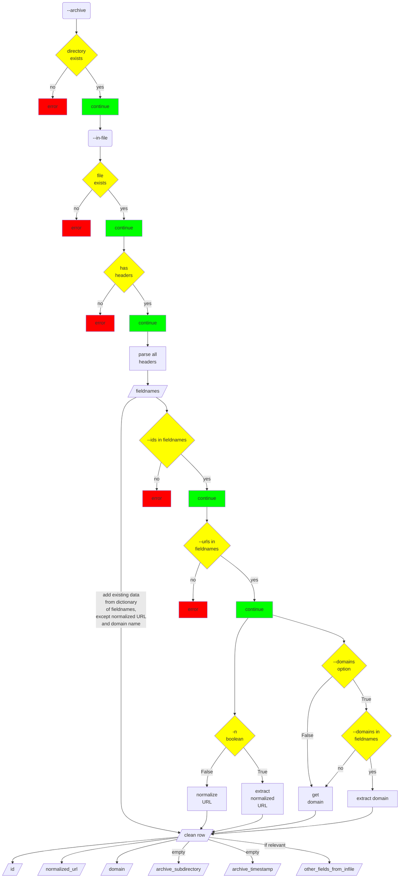

# Archive HTML

The program `archive-html` takes a list (CSV file) of URLs and enriches each row with the following data:

1. **metadata about the URL**
    - normalized version of the URL
    - domain name
2. **archive**:
    - name of a sub-directory which contains a file of the page's scraped HTML
    - timestamp of when the HTML was scraped and archived

# Proposed Data Structure

From the Command Line (CLI), the user provides a path to the archive which will store the scraped HTML, a path to the in-file which contains the URLs and their IDs, as well as the header names of the 2 mandatory columns: IDs and URLs. As shown in the diagram below, the path to the archive and the path to the in-file CSV are used to create each archived URL's sub-directory and the enriched out-file, respectively.



The name of each sub-directory in the archive is a hash of the normalized URL, which guarantees that the archive does not contain duplicate archives of the same URL.

The normalized URL is hashed using Python's native `md5` package.

```python
from hashlib import md5
hash_of_url = md5(str.encode(normalized_url)).hexdigest()
```

## The In-File
The in-file must (a) be a CSV (b) with headers and (c) have a column with a URL's unique ID and a column with the URL itself.

### **Minimum Requirements of the In-File:**
|id|url|
|--|--|
|tcbeehb0040dumd|https://medialab.sciencespo.fr/activites/epo/|
|qvsfbq6yfkwgtm3|https://twitter.com/bu_unistra/status/1592121602480955392|
|2gm269lmsapwn49|https://www.dariah.eu/2022/10/10/mutual-learning-workshop-for-improving-cultural-heritage-bibliographical-data/|


### **Maximum Elements of the In-File Taken into Account**
The in-file CSV can contain many columns and metadata, but the program `archive-html` will only take into account the following data:
|id|normalized_url|domain|
|--|--|--|
|tcbeehb0040dumd|medialab.sciencespo.fr/activites/epo|medialab.sciencespo.fr|
|qvsfbq6yfkwgtm3|twitter.com/bu_unistra/status/1592121602480955392|huma-num.fr|
|2gm269lmsapwn49|dariah.eu/2022/10/10/mutual-learning-workshop-for-improving-cultural-heritage-bibliographical-data|dariah.eu|


## The Out-Files
The program `archive-html` generates two types of files. 

1. First, it produces an enriched CSV, which rewrites all the existing data from the in-file and adds data about the archived HTML. In the case of a simple in-file with a raw URL (https://medialab.sciencespo.fr/activites/epo/) and its ID (tcbeehb0040dumd), the out-file would look like the following:

|id|normalized_url|domain|archive_subdirectory|archive_timestamp|
|--|--|--|--|--|
|tcbeehb0040dumd|medialab.sciencespo.fr/activites/epo|medialab.sciencespo.fr|8b058b21fea0cd4d36368998dc1b18a5|2022-11-18 14:53:44.844199|

2. Second, inside an archive whose path the user provides from the Command Line, the program `archive-html` produces sub-directories for each URL succesfully scraped and archived.
    - example: `archive/8b058b21fea0cd4d36368998dc1b18a5/8b058b21fea0cd4d36368998dc1b18a5.html`

### *wish-list*:
3. *We would like to also resolve URLs discovered in the scraped HTML and save them to a CSV in the archived URL's sub-directory.*
4. *And we would like to download media files in the scraped HTML and save them to the archived URL's sub-directory.*


# Proposed Architecture

## Command Line
The program will except 6 arguments.
- `--archive` (**required**, dir) : path to the main archive directory
- `--infile` (**required**, file) : path to the in-file CSV
- `--urls` (**required**, str) : name of column containing the URLs to be processed
- `--ids` (**required**, str) : name of column of the URLs' IDs
- `--domains` (*optional*, str) : name of column of the domain names, if present
- `-n` (*optional*, bool) : True if the given URLs are already normalized



## Clean Data
The program then parses the CLI arguments and prepares a clean, working file to which information about the archived HTML will be added.

