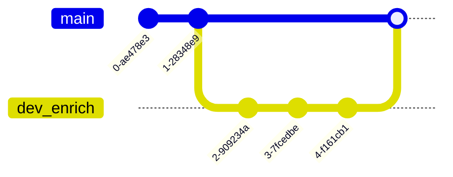

# Next Steps

## Getting Started

1. Cone this Git repository.
2. Create a virtual environment and activate it.
3. Install the dependencies: `click`, `minet`, `pylint`, and `ural`
```bash
$ pip install click minet pylint ural
```

## Step 1.

Read the [README.md](README.md) file and existing Python modules to familiarize yourself with the respository.

1. Understand the program's objective.

    - What sort of data does the program take in? What does the incoming data look like / how is it structured?

    - What does the program yield?

2. Understand the program's architecture / approach to the objective.

    - How does [fetch.py](fetch.py) parse arguments from the Command Line Interface (CLI)?

    - How does [fetch.py](fetch.py) parse the CSV file?

    - How does [fetch.py](fetch.py) write the out-file?

    - What data (arguments) do the modules [enrich.py](enrich.py) and [archive.py](archive.py) take? What does each one need to return?

3. Try it out.

While enrich.py and fetch.py simply return the row as is, you can test the incomplete program on the data in `test_data.csv`.
```bash
$ mkdir archive
$ python fetch.py --archive archive/ --infile test_data.csv --urls source_url
```
Without the option `--outfile`, the result should appear at the outfile's default file path. You can find what the default is by examining the `--outfile` Click option, which decorates the `cli()` command in [fetch.py](fetch.py). The Click option has a parameter `default=`.

## Step 2.

Create a new branch on which to develop the new `enrich_row()` function. Give it a meanintful title, like `dev_enrich`. You will develop the function on this development branch. Eventually, once the function is ready (Step 3 is done), you'll "merge" the `dev_enrich` branch to the main branch and push your merged main branch to the remote.


>Note: The first time you push commits on a new local branch to the remote (origin) repository, you will need to tell the remote that it needs to make a new branch and you'll need to help it name the new remote branch.

## Step 3.

Complete the function `enrich_row()` in the module [enrich.py](enrich.py) so that it returns a dictionary `row` object with values in the keys `normalized_url_col` and `domain_col`. Do not overwrite these values if the row's dictionary already has them (aka, if the data file already had the normalization and domain name for the URL in that row).

Make use of URAL's functions `normalize_url()` and `get_domain()`.

As you develop `enrich_row()` (and any helper functions in the module), "lint" your code to make sure it's clean and conforms to Python's norms. To "lint" your code in `enrich.py`, type the following command in the terminal:
```bash
$ pylint --rcfile .pylint enrich.py
```
Try to clean up any issues the linter finds. Note: Sometimes it's ok to break the norms and not follow the linter's advice, but it's good to have a good reason.

## Step 4.

Make another branch! Each branch should serve one specific purpose, so make a new branch for the development of `archive_row()`. You can name it something like `dev_archive`.


## Step 5.

Complete the function `archive_row()` in [archive.py](archive.py) so that it returns a dictionary `row` object with values in the keys `archive_subdirectory` and `archive_timestamp`. Do not give values to these keys if the normalized URL's HTML was not able to be archived.

Make use of Minet's functions.

> Hint: We want to call the normalized versions of the URLs in the dataset. Normalized URLs lack what's called a "protocol", in example "https://". However, Minet cannot fetch a URL that lacks a protocol. You'll need to respond to this.

And, again, use the command `pylint` in the terminal to check your code.

```bash
$ pylint --rcfile .pylintrc archive.py
```
